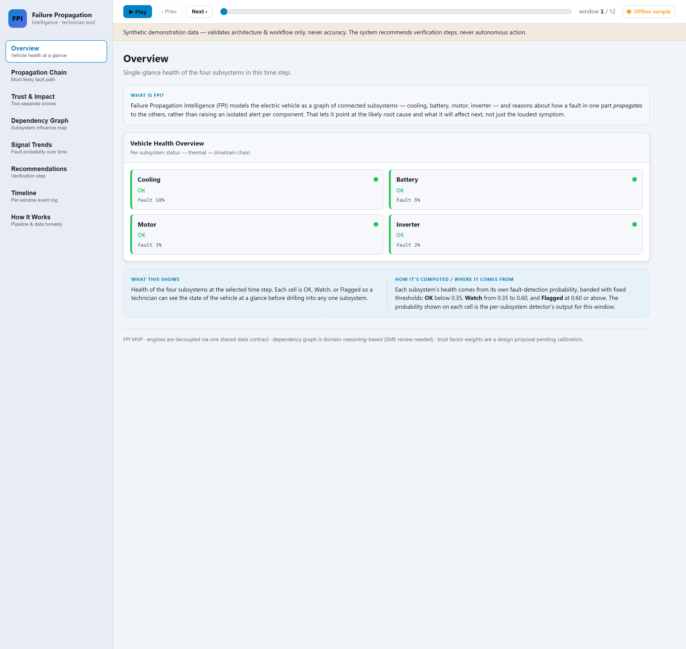

# Failure Propagation Intelligence (FPI)

**Edge-AI decision support for failure propagation in EV subsystems.**
*Research / hackathon-stage prototype — not a deployed product.*

> FPI models an electric vehicle as a **graph of interdependent subsystems** and reasons
> about how a fault *propagates* (cooling → battery → motor → inverter → power derate),
> instead of alerting on each component in isolation. It answers three questions that
> component-level predictive maintenance does not: **where did a fault originate, how
> will it propagate, and how much does that matter** — and it says **how much to trust**
> each prediction.

This repository implements the MVP described in
`Failure_Propagation_Intelligence_Whitepaper (1).docx`. See `PROJECT_PLAN.md` for the
full build plan mapped to the whitepaper sections.

## Dashboard



The technician panel grid (§14) running on demonstration data: single-glance subsystem
health, the active propagation chain with origin and next-at-risk nodes, **Trust and
Impact shown as two separate scores (never merged)**, the subsystem dependency graph,
signal trends, and verification-only recommendations. Shown here in offline sample mode;
it renders the same against the live API.

---

## Honesty guardrails (please read)

Carried directly from the whitepaper — every derived pitch/report must preserve these:

- **No measured performance is claimed.** All metrics are *evaluation targets* (§15).
- **Synthetic data validates architecture and workflow only — never accuracy** (§12).
- **The system recommends verification steps, never autonomous actions** like part
  replacement (§11). A code-level guard enforces this.
- **Probability ("how likely") and Trust ("how much to rely on it") are shown side by
  side and never blended into one number** (§9, §14).
- The subsystem dependency graph is **domain-reasoning-based, not a learned causal
  model**, and needs SME review before any real use (§18).

---

## Architecture — one pipeline, four stages (§7)

```
Vehicle Data (synthetic / public replay)
      │ time-aligned signal windows
      ▼
Edge AI Core  ── per-subsystem fault probability        fpi/detection.py
      ▼
1. Propagation Engine  → ranked propagation paths, ETA    fpi/propagation.py
      ▼
2. Trust Engine        → decision-confidence 0–100        fpi/trust.py
      ▼
3. Impact Engine       → operational priority 0–100       fpi/impact.py
      ▼
4. Evidence Engine     → verification recommendation       fpi/recommendation.py
      ▼
Technician Dashboard (React, §14)                          dashboard/
```

All stages exchange the dataclasses in `fpi/schemas.py` (the single shared contract).
`fpi/pipeline.py` orchestrates them; `api/main.py` serves the result; `fpi/graph.py`
holds the dependency graph.

---

## Quickstart

### 1. Python core + demo
```bash
pip install -r requirements.txt

# generate a synthetic thermal->drivetrain scenario
python scripts/generate_data.py --out data/scenario.json

# run the full pipeline end-to-end and print a technician-ready decision
python scripts/run_demo.py
```
The demo shows the headline behavior: while only the **cooling** subsystem shows a mild
signal, FPI names cooling as the **origin**, predicts the downstream chain, reports a
**trust** score separate from probability, an **impact** score, and recommends
**inspecting the coolant system — not replacing the battery**.

### 2. API
```bash
uvicorn api.main:app --reload          # http://localhost:8000  (/docs for OpenAPI)
```
Endpoints: `GET /health`, `GET /api/graph`, `GET /api/demo/scenario`, `POST /api/evaluate`.

### 3. Dashboard (§14 panel grid)
```bash
cd dashboard
npm install
npm run dev                            # http://localhost:5173
```
The dashboard renders standalone on bundled sample data if the API is down
(set `VITE_API_BASE` to point at the API).

### 4. Everything via Docker
```bash
docker compose up      # api on :8000, dashboard on :5173
```

---

## Tests & evaluation

```bash
python -m pytest -q          # unit + integration + API tests
python scripts/evaluate.py   # §15 synthetic-measurable metrics (NOT field results)
```

`scripts/evaluate.py` reports origin-identification accuracy, propagation lead time,
and false-alarm rate over seeded synthetic runs with a *known injected* origin — a
workflow/architecture check only, per the guardrails above.

---

## Datasets (§12)

- **Real public benchmarks** (`fpi/datasets.py`, `docs/DATASETS.md`) — now wired in and
  used to validate **per-subsystem detection** on real data:
  - **NASA PCoE Li-ion battery aging** (B0005) → battery detector (US-Gov public domain)
  - **CWRU 12 kHz bearing vibration** (normal + seeded faults) → motor detector (free for research)
  ```bash
  python scripts/fetch_datasets.py     # download + cache into data/real/ (gitignored)
  python scripts/validate_real.py      # train on real data, report held-out accuracy
  ```
  Measured on held-out real data: battery ~0.98, motor ~1.00 (see `docs/DATASETS.md`;
  capacity is excluded from battery features to avoid label leakage).
- **Synthetic** (`fpi/synthetic.py`): physics-informed heuristics for the thermal →
  drivetrain cascade — used for the **propagation** demo and workflow validation only.
- **Industrial fleet / CAN / OEM telemetry**: future work, requires a partner (§12 Cat 3).

> **Real = detection, synthetic = propagation.** The real datasets above are
> component-level. No public dataset of real cross-subsystem propagation exists (§18), so
> FPI's propagation cascade remains synthetic and is never claimed as real-data-validated.

---

## Repository layout

| Path | What |
|---|---|
| `fpi/schemas.py` | shared dataclass contract for all stages |
| `fpi/graph.py` | subsystem dependency graph (NetworkX) |
| `fpi/synthetic.py` | synthetic scenario generator + dataset stub |
| `fpi/detection.py` | Edge AI Core — per-subsystem fault detection |
| `fpi/propagation.py` | Stage 1 — Failure Propagation Engine |
| `fpi/trust.py` | Stage 2 — Trust Engine |
| `fpi/impact.py` | Stage 3 — Impact Engine |
| `fpi/recommendation.py` | Stage 4 — Evidence-Based Decision Engine |
| `fpi/pipeline.py` | orchestrates the four stages |
| `api/main.py` | FastAPI service |
| `dashboard/` | React + Vite technician dashboard |
| `scripts/` | `generate_data.py`, `run_demo.py`, `evaluate.py` |
| `tests/` | pytest unit + integration + API tests |

---

## Limitations & open questions (§18)

- No real propagation-labeled vehicle dataset exists; propagation-accuracy is only as
  good as the synthetic simulator.
- The dependency-graph structure is engineering reasoning, not a fitted causal model.
- Edge performance figures (§15) are targets until run on real target hardware
  (Jetson Orin Nano / Raspberry Pi 5).
- Trust Engine factor weights are a design proposal; calibration is future work.
- This project does **not** represent a partnership or validated result with Tata
  Technologies or any other named organization.
